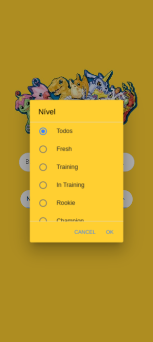

# Digimon

Aplicativo criado em Ionic 6 utilizando como base no Angula. Nele foi criado um buscador de Digimon, seja pelo seu nome quanto pelo seu nível, assim como visualizar todos os Digimons catalogados.

Para isso, foi utilizado da seguinte api pública: [Digimon API](https://digimon-api.vercel.app/)

# Design final

| | | |
|:-------------------------:|:-------------------------:|:-------------------------:|
|||